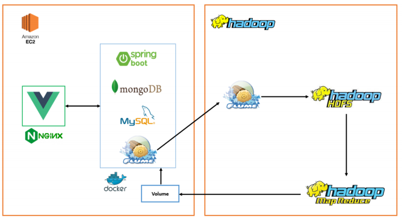
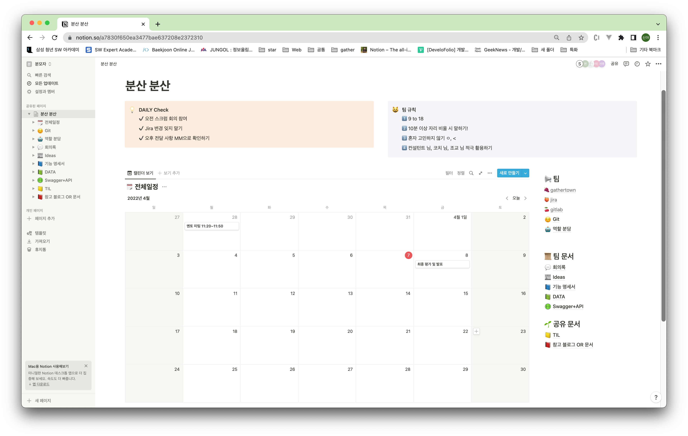
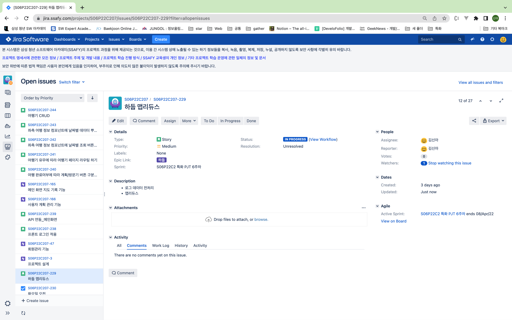
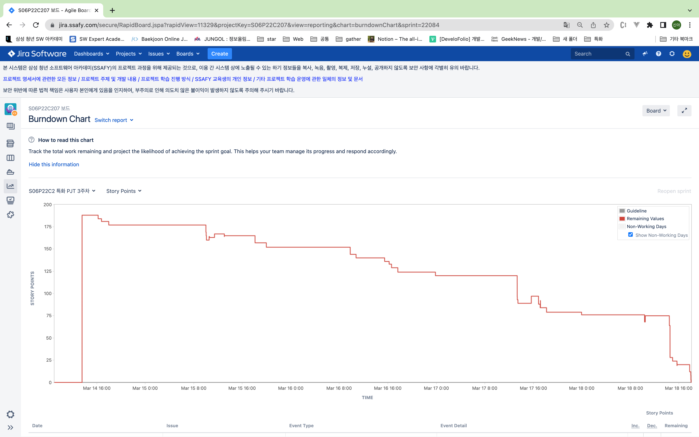
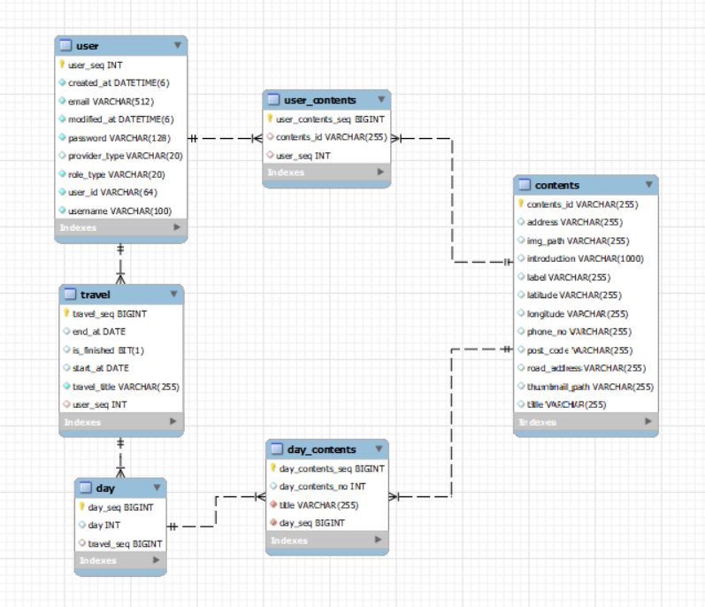
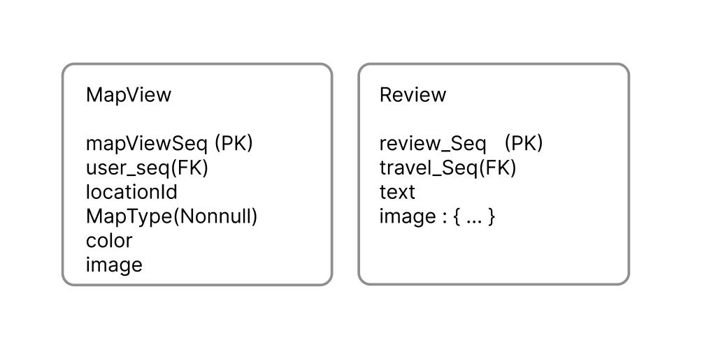

### 어서와, 육지사람

------

- 주제 : 제주도 플래닝 서비스

- 개발 기간 : 2022. 02. 21 ~ 2022. 04. 08 (총 6주)
- 팀명 : 분모자(분산모이자)

### 팀원 소개 및 역할

------

| Name     | 김신아                      | 김도연                      | 김소은                      | 유진주                      | 임혁                    | 황선주                      |
| -------- | --------------------------- | --------------------------- | --------------------------- | --------------------------- | ----------------------- | --------------------------- |
| Profile  |  |  |  |  |  |  |
| Position | Leader & Backend            | Backend                     | Frontend                    | Backend                     | Backend                 | Frontend                    |
| Git      |                             |                             |                             |                             |                         |                             |

### 주요 기능

------

### 기술 스택

------

**Front-End**

     

**Back-End**

     

    

**CI/CD**

   

**Tool**

     

### **Architecture**

------

### 형상관리 및 기획

------

**Notion**

**Jira**

**Burndown Chart**

**ERD**

- MySQL

- MongoDB

| 구분           | 링크                                                         |
| -------------- | ------------------------------------------------------------ |
| Notion         | [notion](https://spectacled-wheel-dcf.notion.site/a7830f650ea3477bae637208e2372310) |
| Documents      | [ppt]()                                                      |
| Git Convention | [notion-convention](https://spectacled-wheel-dcf.notion.site/Git-35e01ed053944aa282aeb2de3d985d21) |
| Wire Frame     | [figma](https://www.figma.com/file/PxeNKNfnZpKTMSciW6EM5K/BoonMoJa?node-id=0%3A1) |

### 디렉토리 구조

------

**Back-end**

- [보러가기](./BE/README.md)

**Front-end**

- [보러가기](./BE/README.md)

