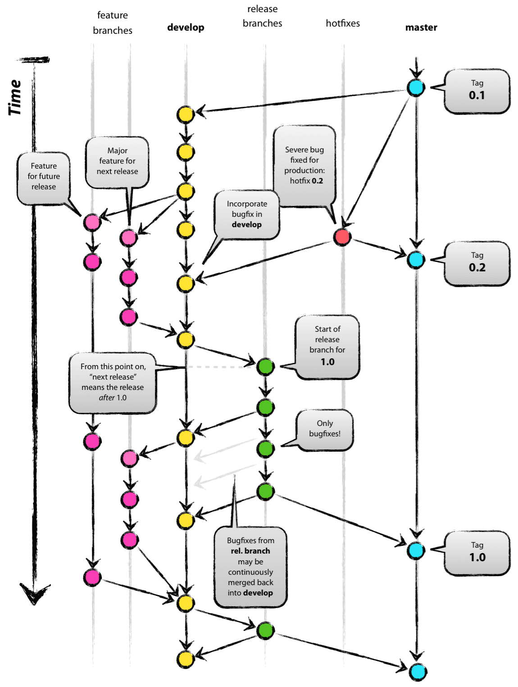

# Git Flow

<br>

### 1️⃣ Git-flow란?

- Vincent Driessen이 제안한 브랜치 모델을 쉽게 사용할 수 있도록 명령을 구현해 놓은 git의 확장
- 기능이 아닌 서로간의 약속인 방법론
- 완벽한 방법론이 아닌, 각자 개발 환경에 따라 수정하고 변경하여 사용



<br>

### 2️⃣ branch model

[Main branch]

**master**

- 정식 배포되는 안정적인 버전의 소스코드가 관리되는 곳

**develop**

- 버그를 수정하기 위한 코드나 새로운 기능을 추가하기 위한 코드, 성능을 개선하기 위한 코드들이 검증이 완료된 후 PR 요청을 거치고 병합되는 곳

---

[Sub branch]

**feature**

- 새로운 기능 개발 혹은 버그 수정을 위한 코드 수정이 워지는 곳
- 개발자 혼자 작업이 가능하며, 특정 기능 개발을 위해 여러 개발자들이 공동으로도 작업 가능

**release**

- 릴리즈를 하기 위한 목적으로 생성되는 곳
- develop 브랜치를 기반으로 생성

**hotfix**

- 정기적인 릴리즈 이외에 급하게 반영해야할 버그 수정을 위해 생성되는 곳
  
    (다음 릴리즈를 기다릴 수 없을 정도로 바로 반영되어야 하는 경우)
    
- master 브랜치를 기반으로 생성

    <br>

### 3️⃣ Git-flow init

```bash
$ git flow init
```

- 로컬 환경에서 각자 설치 필요
- master, develop 브랜치 생성
- feature, release, hotfix, support 브랜치는 개발 진행시 생성하는 구조

<br>

### 4️⃣ Git-flow 사용법

1. feature
    1. feature 브랜치 생성 전에 원격 develop 브랜치에서 최신 코드 내려받기
        - —rebase 옵션 : 원격 develop 브랜치의 최신본을 기준으로 코드를 갱신하여 커밋 그래프가 얽히지 않고 순차적으로 구현된 것처럼 깔끔하게 구성됨
        
        ```bash
        $ git pull --rebase origin develop
        ```
        
    2. feature 브랜치 시작
        - ‘feature/’가 브랜치명 앞에 자동으로 생성되기 때문에 브랜치명만 작성하면 됨
        - ‘feature 브랜치 생성 → feature 브랜치 checkout’ 를 통합한 명령어
        
        ```bash
        $ git flow feature start <feature-name>
        ```
        
    3. 개발 코드 commit
       
        ```bash
        $ git commit -m 'git 컨벤션에 따른 commit message 작성'
        ```
        
    4. feature 브랜치 마무리
        - 코드리뷰가 필요 없을 경우 바로 사용 가능
        - ‘develop 브랜치 checkout → develop 브랜치에 merge → feature 브랜치 삭제’를 통합한 명령어
        - —no-ff 옵션 : 어떤 브랜치에서 merge 했는지 기록을 남김
        
        ```bash
        $ git flow feature finish --no-ff <feature-name>
        ```
        
    - feature 브랜치 push
        - 코드리뷰가 필요할 경우 로컬에만 존재하는 feature 브랜치를 원격 저장소에 push하고 싶을 경우 사용
        - 다른 컴퓨터나 다른 사용자가 접근하여 작업 가능
        
        ```bash
        $ git flow feature publish <feature-name>
        ```
        
    - feature 브랜치 pull
      
        ```bash
        $ git flow feature pull origin <feature-name>
        ```
        

1. release
    - release 브랜치 생성
      
        ```bash
        $ git flow release start <version>
        ```
        
    - release 브랜치 마무리
      
        ```bash
        $ git flow release finish <version>
        ```
        
    - release 브랜치 push
      
        ```bash
        $ git flow release publish <version>
        ```
        
    - release 브랜치 pull
      
        ```bash
        $ git flow release track <version>
        ```
        

<br>

<br>

📚 References

- [https://hbase.tistory.com/60](https://hbase.tistory.com/60)
- [https://uxgjs.tistory.com/183](https://uxgjs.tistory.com/183)
- [https://otrodevym.tistory.com/entry/git-git-flow-사용법](https://otrodevym.tistory.com/entry/git-git-flow-%EC%82%AC%EC%9A%A9%EB%B2%95)

⭐ [https://jinwoo1990.github.io/git/git-flow-tutorial/](https://jinwoo1990.github.io/git/git-flow-tutorial/)