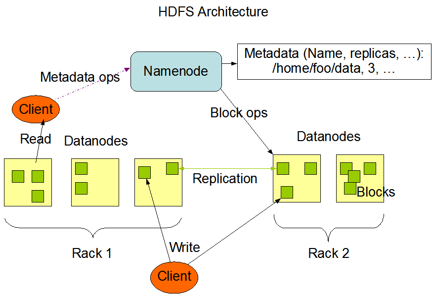

# HDFS

<br>

#### 1️⃣ HDFS란?

- 범용 하드웨어에서 동작하고, 장애 복구성을 가지는 분산 파일 시스템
- 실시간보다는 배치처리를 위한 설계 시스템
- 네임노드 관리 중요

<br>

#### 2️⃣ 특징

1. **블록 단위 저장**
    - 블록 사이즈보다 작은 파일은 기존 파일의 사이즈로 저장
    - 블록 사이즈보다 큰 파일을 블록 단위로 나누어 저장
    
2. **장애 복구**
    - 장애 복구를 위해 블록을 복제하여 저장
    - 기본 복제 단위 : 3
    
3. **읽기 중심**
    - 데이터를 한 번 쓰면 여러번 읽는 것을 목적으로 함
    - 파일 수정 지원X → 동작 단순화 → 읽을 때 속도 향상
    
4. **데이터 지역성**
    - 데이터가 있는 곳에서 알고리즘을 처리하여 네트워크를 통해 이동시키는 비용을 줄일 수 있음
    

<br>

#### 3️⃣ 구조

- 마스터 슬레이브 구조 = 네임노드 1개 + 데이터노드 N개



- 네임노드 : 메타데이터 관리와 데이터노드 관리
- 데이터노드 : 파일을 저장하는 역할

<br>

#### 4️⃣ HDFS Federation

- 파일이 많아지면 메모리 사용량이 늘어나게 되고, 메모리 관리 문제가 발생하는데 이를 해결

- 페더레이션은 디렉토리 단위로 네임노드를 등록하여 사용하는 것을 의미
  
    ex. user, hadoop, tmp의 디렉토리가 존재할 때 각 디렉토리 단위로 총 3개의 네임노드를 실행하여 관리하게 하는 것
    
- 하둡 v2부터 지원

- 파일, 디렉토리의 정보를 갖는 네임스페이스와 블록의 정보를 가지는 블록 풀을 각 네임노드가 독립적으로 관리

<br>

#### 5️⃣ HDFS 고가용성

- 네임노드에 문제가 발생하면 모든 작업이 중지되는데 이를 해결
- 이중화된 두대의 서버인 액티브 네임노드와 스탠바이 네임노드를 이용하여 지원
    - 액티브 네임노드 : 네임노드 역할 수행
    - 스탠바이 네임노드 : 액티브 네임노드와 동일한 메타데이터 정보 유지
- 하둡 v2부터 지원

<br>

#### 6️⃣ HDFS 세이프모드

- 데이터 노드를 수정할 수 없는 상태를 의미
- 데이터는 읽기 전용 상태가 되며, 추가와 수정이 불가능하며 데이터 복제도 일어나지 않음
- 네임모드에 문제가 생겨 정상적인 동작을 할 수 없을 때 사용

```bash
# 세이프 모드 상태 확인 
$ hdfs dfsadmin -safemode get

# 세이프 모드 진입 
$ hdfs dfsadmin -safemode enter

# 세이프 모드 해제 
$ hdfs dfsadmin -safemode leave
```

<br>

#### 7️⃣ HDFS 데이터 블록 관리

- 커럽트(Corrupt) 상태
- 복제 개수 부족(Under replicated) 상태

<br>

#### 8️⃣ HDFS 휴지통

- 사용자의 실수에 의한 파일 삭제를 방지하기 위한 기능
- 위치 :  /user/유저명/.Trash

```bash
# 휴지통을 비움. 
$ hadoop fs -expunge
```

<br>

#### 9️⃣ HDFS 명령어

- **사용자 커맨드, 운영자 커맨드, 디버그 커맨드**로 구분

1. 사용자 커맨드
    - hdfs, hadoop 쉘 이용이 가능하며, 일부는 hdfs 쉘만 동작하기 때문에 헷갈리지 않도록 주의!
    
    | 커맨드 | 설명 |
    | --- | --- |
    | classpath | Hadoop jar 파일에 필요한 클래스 패스 출력 |
    | dfs | 파일 시스템 쉘 명령어(fs 명령어와 동일) |
    | fetchdt | 네임노드의 델리게이션 토큰 확인 |
    | fsck | 시스템 상태 체크 |
    | getconf | 설정된 config 정보 확인 |
    | groups | 사용자에 설정된 그룹 정보 확인 |
    | jmxget | JMX 정보 확인 |
    | oev | Offline Edits Viewr, Edits 파일의 상태 확인 |
    | oiv | Offline Edits Viewr, 이미지 파일의 상태 확인(v2.4 이상) |
    | snapshotDiff | HDFS 스냅샷의 상태 확인 |
    | version | 버전 확인 |
    
2. 운영자 커맨드
    - 주로 실행, 설정 관련 명령어
    
    | 커맨드 | 설명 |
    | --- | --- |
    | namenode | 네임노드 실행 |
    | datanode | 데이터노드 실행 |
    | secondarynamenode | 세컨더리 네임노드 실행 |
    | balancer | HDFS 밸런싱 처리 |
    | cacheadmin | 자주 읽는 데이터에 대한 캐쉬 처리 |
    | crypto | 암호화 처리 |
    | dfsadmin | HDFS 관리를 위한 Admin 유틸리티 명령 |
    | dfsrouter | HDFS 연합 라우팅 실행 |
    | dfsrouteradmin | 데이터 노드 라우팅 설정 |
    | haadmin | HA 실행 명령어(QJM 또는 NFS) |
    | journalnode | QJM을 이용한 HA, 저널노드용 명령어 |
    | mover | 데이터 마이그레이션용 유틸리티 명령어 |
    | nfs3 | NFS3 게이트웨이 명령어 |
    | portmap | NFS3 게이트웨이 포트맵 명령어 |
    | storagepolicies | HDFS 저장정책 설정 명령어 |
    | zkfc | 주키퍼 FailOver 컨트롤러 실행 |
    

<br>

#### 🔟 WebHDFS REST API

- REST API를 이용하여 파일 조회, 생성, 수정, 삭제하는 기능 제공
- 원격지에 서 HDFS의 내용에 접근하는 것이 가능
- 설정
    - 파일 : hdfs-site.xml
    
    ```xml
    <property>
        <name>dfs.webhdfs.enabled</name>
        <value>true</value>
    </property>
    <property>
        <name>dfs.namenode.http-address</name>
        <value>0.0.0.0:50070</value>
    </property>
    ```