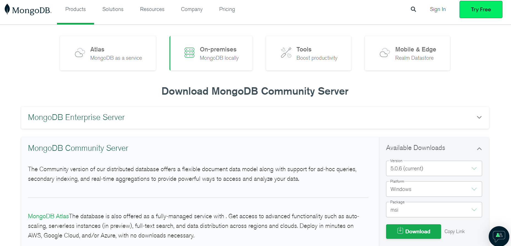

# MongoDB 설치 방법

 

### [DB 설치]

**1️⃣ MongoDB 사이트에서 Community Server를 자신의 PC 환경에 맞춰서 설치한다.**

- [https://www.mongodb.com/try/download/community](https://www.mongodb.com/try/download/community)
- MongoDB 사용을 도와줄 MongoDB Compass는 Community Server에 포함되어 있어서 별도로 설치하지 않아도 됨

**2️⃣ 설치 시작**

**3️⃣ 약관 동의를 체크한 후 Next를 클릭한다.**

**4️⃣ 설치 유형을 선택하고 Next를 클릭한다.**

- Complete : 기본 경로로 모든 기능이 포함된 상태를 설치
- Custom : 경로를 따로 설정 가능

**5️⃣ 설치 경로를 확인한 후 Next를 클릭한다.**

**6️⃣ MongoDB Compass 설치 여부를 선택하고 Next를 클릭한다.**

- MongoDB Compass : MongoDB를 편리하게 사용할 수 있게 도와주는 GUI 툴

**7️⃣ 설치 완료**

 

### [환경 변수 설정]

**1️⃣ PC에서 ‘시스템 환경 변수 편집’으로 들어와서 환경변수를 클릭한다.** 

**2️⃣ 환경변수에서 시스템 변수 - Path를 선택하고, 편집을 클릭한다.**

**3️⃣ MongoDB가 설치된 경로에서 bin 파일까지의 경로를 추가한다.**

**4️⃣ 설정 완료 후 cmd창을 열어서 MongoDB가 정상적으로 설치되었는지 확인한다**.

- mongo —version

**5️⃣ localhost:27017로 접속하여 해당 문구가 뜬다면 정상적으로 설정이 완료된 것이다.**

 

### [MongoDB Compass]

- MongoDB를 편리하게 사용하기 위한 GUI 툴

(MongoDB Compass가 아닌 Robo3T도 많이 사용하는 것 같음)

**1️⃣ MongoDB에 접속하기 위해 접속할 url을 입력하고 connect를 클릭한다.**

**2️⃣ 연결 성공!**

