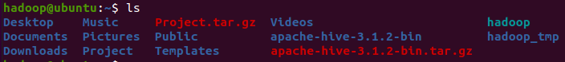

# 하이브 설치 및 환경설정

<br>

### [ 하이브 설치 ]

- 버전 : 3.1.2

1. 사용할 버전에 맞춰서 Hive 다운로드 받기
   
    ```bash
    $ wget https://downloads.apache.org/hive/hive-3.1.2/apache-hive-3.1.2-bin.tar.gz
    ```
    
2. 다운받은 파일 압축 해제하기
   
    ```bash
    $ tar xzf apache-hive-3.1.2-bin.tar.gz
    ```
    
    
    
    <br>

### [ 하이브 환경설정 ]

1. 환경변수 추가하기
    - export HIVE_HOME=”/home/hadoop/apache-hive-3.1.2-bin”
    - export PATH=”$PATH:$HIVE_HOME/bin”
    
    (위의 내용을 복사하게되면 따옴표가 잘 인식되지않아 오류가 발생하는 경우 있으므로 색상의 변화가 있는지 잘 확인하자..! 그리고 path에도 따옴표를 넣어줘야 되는것같다. 혹시 오류가 나면 이것도 확인해보길)
    
    ```bash
    $ nano .bashrc
    ```
    
2. 변경사항 적용하기
   
    ```bash
    $ source ~/.bashrc
    ```
    

<br>

### [ Hive와 HDFS 상호작용 설정 ]

1. hive-config.sh 파일에 환경변수 추가하기
    - export HADOOP_HOME=/home/hdoop/hadoop-3.2.1
    
    ```bash
    $ nano /apache-hive-3.1.2-bin/bin/hive-config.sh
    ```
    
    
    

<br>

### [ HDFS에 Hive 디렉토리 생성 ]

- 데이터를 저장하기 위해 분리된 2개의 디렉토리 생성(tmp, warehouse)

1. 하둡 실행하기
   
    ```bash
    $ start-dfs.sh
    ```
    
1. tmp 디렉토리 생성하기
    - Hive process의 중간 데이터 결과 저장하는 곳
    
    ```bash
    $ hdfs dfs -mkdir /tmp
    ```
    
2. tmp 디렉토리에 쓰기 및 실행 권한 부여하기
   
    ```bash
    $ hdfs dfs -chmod g+w /tmp
    ```
    
    (권한 부여 전)
    
    
    
    (권한 부여 후)
    
    
    
1. warehouse 디렉토리 생성하고 쓰기 및 실행 권한 부여하기
    - Hive와 관련된 테이블 저장하는 곳
    
    ```bash
    $ hdfs dfs -mkdir -p /user/hive/warehouse
    $ hdfs dfs -chmod g+w /user/hive/warehouse
    ```
    

<br>

### [ hive-site.xml 파일 설정 ]

1. conf 디렉토리로 이동하기
   
    ```bash
    $ cd home/hadoop/apache-hive-3.1.2-bin/conf
    (= cd $HIVE_HOME/conf)
    ```
    
    
    
2. hive-default.xml.template 파일을 hive-site.xml 명으로 복사하기
   
    ```bash
    $ cp hive-default.xml.template hive-site.xml
    ```
    
3. hive-site.xml 수정하기
    - property 2개 추가하기
    
    ```bash
    <property>
        <name>system:java.io.tmpdir</name>
        <value>/tmp/hive/java</value>
    </property>
    <property>
        <name>system:user.name</name>
        <value>${user.name}</value>
    <property>
    ```
    
    ```bash
    $ nano hive-site.xml
    ```
    
    
    

- connectionurl 수정하기
- ctrl+w로 javax.jdo.option.ConnectionURL 검색해서 찾기

```bash
jdbc:derby:/home/hdoop/apache-hive-3.1.2-bin/metastore_db;databaseName=metastore_db;create=true
```


<br>

### [ derby database 시작 ]

(오류발생)


(시도1 : 아직 오류 해결 못함)

- hadoop이 설치된 위치와 hive 설치 위치를 동일하게 변경시켜줌
- hadoop 설치 위치 : /usr/local/hadoop
- hive 설치 위치 : /usr/local/hive

```bash
$ sudo mv apache-hive-3.1.2-bin /usr/local/hive
```